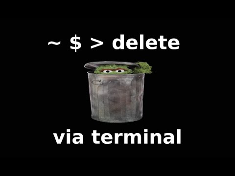
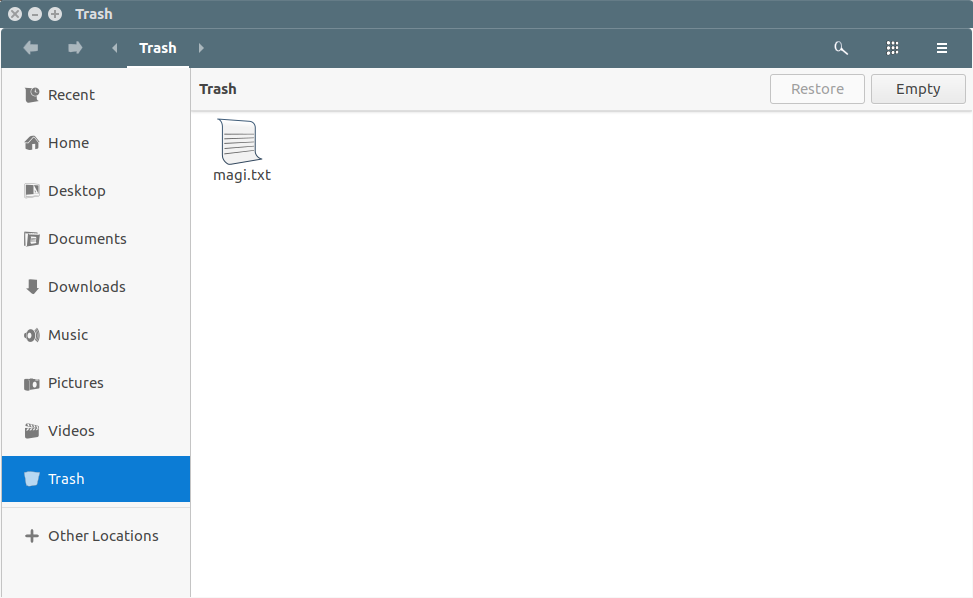

​	人类犯错误是因为我们不是一个可编程设备，所以，在使用 rm [命令](https://www.linuxcool.com/)时要额外注意，不要在任何时候使用 rm -rf *。当你使用 rm [命令](https://www.linuxcool.com/)时，它会永久删除文件，不会像文件管理器那样将这些文件移动到 “垃圾箱”。



​	有时我们会将不应该删除的文件删除掉，所以当错误地删除了文件时该怎么办？ 你必须看看恢复工具（[Linux](https://www.linuxprobe.com/) 中有很多数据恢复工具），但我们不知道是否能将它百分之百恢复，所以要如何解决这个问题？

​	将文件移动到“垃圾桶”是一个好主意，当你无意中运行 rm 命令时，可以拯救你；但是很少有人会说这是一个坏习惯，如果你不注意“垃圾桶”，它可能会在一定的时间内被文件和文件夹堆积起来。在这种情况下，我建议你按照你的意愿去做一个定时任务。

​	这适用于服务器和桌面两种环境。 如果脚本检测到 GNOME 、KDE、Unity 或 LXDE 桌面环境（DE），则它将文件或文件夹安全地移动到默认垃圾箱  `$HOME/.local/share/Trash/files`，否则会在您的主目录中创建垃圾箱文件夹 `$HOME/Trash`。

saferm.sh 脚本托管在 Github 中，可以从仓库中克隆，也可以创建一个名为 saferm.sh 的文件并复制其上的代码。

```bash
git clone https://github.com/lagerspetz/linux-stuff
sudo mv linux-stuff/scripts/saferm.sh /bin
rm -Rf linux-stuff
```

在 .bashrc 文件中设置别名，

```bash
alias rm=saferm.sh
```

执行下面的命令使其生效，

```
source ~/.bashrc
```

一切就绪，现在你可以执行 rm 命令，自动将文件移动到”垃圾桶”，而不是永久删除它们。

测试一下，我们将删除一个名为 aaa的文件夹，命令行明确的提醒了Moving aaa/ to /home/breeze/.local/share/Trash/files

```
rm -rf aaa/
Moving aaa/ to /home/breeze/.local/share/Trash/files
```


或者我们可以通过文件管理器界面中查看相同的内容。



要了解 saferm.sh 的其他选项，请查看帮助。

```
$ saferm.sh -h
This is saferm.sh 1.16. LXDE and Gnome3 detection.
Will ask to unsafe-delete instead of cross-fs move. Allows unsafe (regular rm) delete (ignores trashinfo).
Creates trash and trashinfo directories if they do not exist. Handles symbolic link deletion.
Does not complain about different user any more.

Usage: /path/to/saferm.sh [OPTIONS] [--] files and dirs to safely remove
OPTIONS:
-r      allows recursively removing directories.
-f      Allow deleting special files (devices, ...).
-u      Unsafe mode, bypass trash and delete files permanently.
-v      Verbose, prints more messages. Default in this version.
-q      Quiet mode. Opposite of verbose.
```