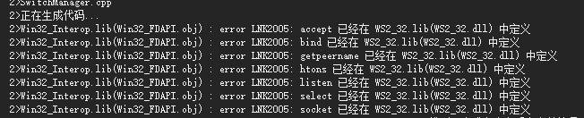

#### C++ Redis on Windows 上Win32_Interop.lib和WS2_32.lib冲突的问题

在同时使用Redis连接和[socket](https://so.csdn.net/so/search?q=socket&spm=1001.2101.3001.7020)连接时，遇到了Win32_Interop.lib和WS2_32.lib冲突的问题

引起原因主要是Redis库Win32_FDAPI.cpp有重新定义了socket的一些方法引起来冲突

```cpp
extern "C" {
// Unix compatible FD based routines
fdapi_accept accept = NULL;
fdapi_access access = NULL;
fdapi_bind bind = NULL;
fdapi_connect connect = NULL;
fdapi_fcntl fcntl = NULL;
fdapi_fstat fdapi_fstat64 = NULL;
fdapi_fsync fsync = NULL;
fdapi_ftruncate ftruncate = NULL;
fdapi_freeaddrinfo freeaddrinfo = NULL;
fdapi_getaddrinfo getaddrinfo = NULL;
fdapi_getpeername getpeername = NULL;
fdapi_getsockname getsockname = NULL;
fdapi_getsockopt getsockopt = NULL;
fdapi_htonl htonl = NULL;
fdapi_htons htons = NULL;
fdapi_isatty isatty = NULL;
fdapi_inet_ntop inet_ntop = NULL;
fdapi_inet_pton inet_pton = NULL;
fdapi_listen listen = NULL;
fdapi_lseek64 lseek64 = NULL;
fdapi_ntohl ntohl = NULL;
fdapi_ntohs ntohs = NULL;
fdapi_open open = NULL;
fdapi_pipe pipe = NULL;
fdapi_poll poll = NULL;
fdapi_read read = NULL;
fdapi_select select = NULL;
fdapi_setsockopt setsockopt = NULL;
fdapi_socket socket = NULL;
fdapi_write write = NULL;
}
auto f_WSACleanup = dllfunctor_stdcall<int>("ws2_32.dll", "WSACleanup");
auto f_WSAFDIsSet = dllfunctor_stdcall<int, SOCKET, fd_set*>("ws2_32.dll", "__WSAFDIsSet");
auto f_WSAGetLastError = dllfunctor_stdcall<int>("ws2_32.dll", "WSAGetLastError");
auto f_WSAGetOverlappedResult = dllfunctor_stdcall<BOOL, SOCKET, LPWSAOVERLAPPED, LPDWORD, BOOL, LPDWORD>("ws2_32.dll", "WSAGetOverlappedResult");
auto f_WSADuplicateSocket = dllfunctor_stdcall<int, SOCKET, DWORD, LPWSAPROTOCOL_INFO>("ws2_32.dll", "WSADuplicateSocketW");
auto f_WSAIoctl = dllfunctor_stdcall<int, SOCKET, DWORD, LPVOID, DWORD, LPVOID, DWORD, LPVOID, LPWSAOVERLAPPED, LPWSAOVERLAPPED_COMPLETION_ROUTINE>("ws2_32.dll", "WSAIoctl");
auto f_WSARecv = dllfunctor_stdcall<int, SOCKET, LPWSABUF, DWORD, LPDWORD, LPDWORD, LPWSAOVERLAPPED, LPWSAOVERLAPPED_COMPLETION_ROUTINE>("ws2_32.dll", "WSARecv");
auto f_WSASocket = dllfunctor_stdcall<SOCKET, int, int, int, LPWSAPROTOCOL_INFO, GROUP, DWORD>("ws2_32.dll", "WSASocketW");
auto f_WSASend = dllfunctor_stdcall<int, SOCKET, LPWSABUF, DWORD, LPDWORD, DWORD, LPWSAOVERLAPPED, LPWSAOVERLAPPED_COMPLETION_ROUTINE>("ws2_32.dll", "WSASend");
auto f_WSAStartup = dllfunctor_stdcall<int, WORD, LPWSADATA>("ws2_32.dll", "WSAStartup");
auto f_ioctlsocket = dllfunctor_stdcall<int, SOCKET, long, u_long*>("ws2_32.dll", "ioctlsocket");

auto f_accept = dllfunctor_stdcall<SOCKET, SOCKET, struct sockaddr*, int*>("ws2_32.dll", "accept");
auto f_bind = dllfunctor_stdcall<int, SOCKET, const struct sockaddr*, int>("ws2_32.dll", "bind");
auto f_closesocket = dllfunctor_stdcall<int, SOCKET>("ws2_32.dll", "closesocket");
auto f_connect = dllfunctor_stdcall<int, SOCKET, const struct sockaddr*, int>("ws2_32.dll", "connect");
auto f_freeaddrinfo = dllfunctor_stdcall<void, addrinfo*>("ws2_32.dll", "freeaddrinfo");
auto f_getaddrinfo = dllfunctor_stdcall<int, PCSTR, PCSTR, const ADDRINFOA*, ADDRINFOA**>("ws2_32.dll", "getaddrinfo");
auto f_gethostbyname = dllfunctor_stdcall<struct hostent*, const char*>("ws2_32.dll", "gethostbyname");
auto f_getpeername = dllfunctor_stdcall<int, SOCKET, struct sockaddr*, int*>("ws2_32.dll", "getpeername");
auto f_getsockname = dllfunctor_stdcall<int, SOCKET, struct sockaddr*, int*>("ws2_32.dll", "getsockname");
auto f_getsockopt = dllfunctor_stdcall<int, SOCKET, int, int, char*, int*>("ws2_32.dll", "getsockopt");
auto f_htonl = dllfunctor_stdcall<u_long, u_long>("ws2_32.dll", "htonl");
auto f_htons = dllfunctor_stdcall<u_short, u_short>("ws2_32.dll", "htons");
auto f_listen = dllfunctor_stdcall<int, SOCKET, int>("ws2_32.dll", "listen");
auto f_ntohs = dllfunctor_stdcall<u_short, u_short>("ws2_32.dll", "ntohs");
auto f_ntohl = dllfunctor_stdcall<u_long, u_long>("ws2_32.dll", "ntohl");
auto f_recv = dllfunctor_stdcall<int, SOCKET, char*, int, int>("ws2_32.dll", "recv");
auto f_select = dllfunctor_stdcall<int, int, fd_set*, fd_set*, fd_set*, const struct timeval*>("ws2_32.dll", "select");
auto f_send = dllfunctor_stdcall<int, SOCKET, const char*, int, int>("ws2_32.dll", "send");
auto f_setsockopt = dllfunctor_stdcall<int, SOCKET, int, int, const char*, int>("ws2_32.dll", "setsockopt");
auto f_socket = dllfunctor_stdcall<SOCKET, int, int, int>("ws2_32.dll", "socket");
1234567891011121314151617181920212223242526272829303132333435363738394041424344454647484950515253545556575859606162636465
```

**解决办法**
去掉Redis库里面的socket的函数的重定义，把所有使用这些方法的地方都改为下面对应的函数

```cpp
int FDAPI_accept(int rfd, struct sockaddr *addr, socklen_t *addrlen);
int FDAPI_access(const char *pathname, int mode);
int FDAPI_bind(int rfd, const struct sockaddr *addr, socklen_t addrlen);
int FDAPI_connect(int rfd, const struct sockaddr *addr, size_t addrlen);
int FDAPI_fcntl(int rfd, int cmd, int flags);
int FDAPI_fstat64(int rfd, struct __stat64 *buffer);
void FDAPI_freeaddrinfo(struct addrinfo *ai);
int FDAPI_fsync(int rfd);
int FDAPI_ftruncate(int rfd, PORT_LONGLONG length);
int FDAPI_getaddrinfo(const char *node, const char *service, const struct addrinfo *hints, struct addrinfo **res);
int FDAPI_getsockopt(int rfd, int level, int optname, void *optval, socklen_t *optlen);
int FDAPI_getpeername(int rfd, struct sockaddr *addr, socklen_t * addrlen);
int FDAPI_getsockname(int rfd, struct sockaddr* addrsock, int* addrlen);
u_long FDAPI_htonl(u_long hostlong);
u_short FDAPI_htons(u_short hostshort);
u_int FDAPI_ntohl(u_int netlong);
u_short FDAPI_ntohs(u_short netshort);
int FDAPI_open(const char * _Filename, int _OpenFlag, int flags);
int FDAPI_pipe(int *pfds);
int FDAPI_poll(struct pollfd *fds, nfds_t nfds, int timeout);
int FDAPI_listen(int rfd, int backlog);
int FDAPI_socket(int af, int type, int protocol);
int FDAPI_select(int nfds, fd_set *readfds, fd_set *writefds, fd_set *exceptfds, struct timeval *timeout);
int FDAPI_setsockopt(int rfd, int level, int optname, const void *optval, socklen_t optlen);
ssize_t FDAPI_read(int rfd, void *buf, size_t count);
ssize_t FDAPI_write(int rfd, const void *buf, size_t count);
```

修改后的代码地址：
https://github.com/kingsley07/redis-win32