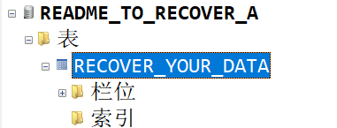
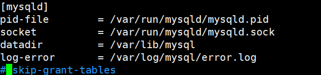

```bash
/etc/mysql/mysql.conf.d
drwxr-xr-x 2 root root  4096 Mar 12 16:56 ./
drwxr-xr-x 4 root root  4096 Mar 12 16:45 ../
-rw-r--r-- 1 root root  1452 Mar 12 16:56 mysqld.cnf
-rw-r--r-- 1 root root 12288 Mar 12 16:55 .mysqld.cnf.swp
```

在`mysqld.cnf`最后插入`skip-grant-tables`

重启mysql，`service mysql restart`

现在进入了安全模式，可以不使用密码进入mysql了

最后还原在前面加上`#`，并重启MySQL即可

